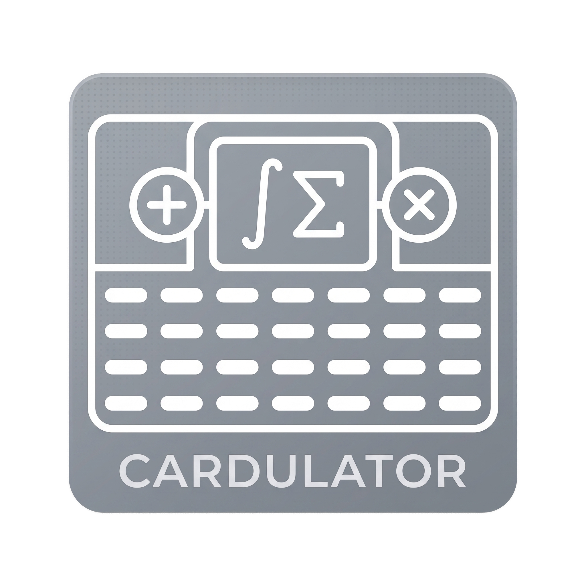

# Cardulator — Scientific REPL Calculator & Scripting Engine for M5Stack Cardputer



[](https://github.com/aroum/cardulator/actions)
[](https://platformio.org/)
[](LICENSE)

**Cardulator** is a powerful, feature-rich scientific mathematical calculator and REPL scripting environment designed specifically for the **M5Stack Cardputer ADV** (ESP32-S3). Built on top of the robust [`TinyExpr-PlusPlus`](https://github.com/Blake-Madden/tinyexpr-plusplus) engine, Cardulator provides real-time syntax highlighting, rainbow bracket matching, SI prefix parsing, scientific notation, user variables and functions, multi-variable formula wizards, a C-style scripting engine with array support, matrix/vector operations, customizable hotkey binds, and interactive 2D function plotting.

---

## 🌟 Key Features

- **High-Performance REPL**: Interactive evaluation loop with `Tab` autocompletion, 1-based answer history (`e1`, `e2`...), SI prefix parsing (`1k` = `1000`, `2M2` = `2,200,000`), scientific notation (`5e10`), and multi-statement lines using `;`.
- **Dynamic Syntax Highlighting**: Real-time rainbow bracket depth matching (`( )`), yellow numbers, cyan variables, magenta constants, and red syntax/error highlighting.
- **2D Plotting Engine (`STATE_PLOT` / `Fn + G`)**: Interactive Matplotlib-like 2D function and vector plotter (`plot(y)`, `plot(x, y, color, linestyle)`) with panning (WASD / Arrows), 5x turbo zoom (`Ctrl + Zoom`), auto-scaling, and `plot.hold()`.
- **Formula Library & Interactive Wizard (`Fn + F`)**: Multi-argument formula manager (up to 4 parameters) with sequential step-by-step evaluation wizards, syntax-highlighted code editor, and NVS persistence.
- **Scripting Engine (`Fn + S`)**: C-style script runner supporting `if/elif/else`, `while`, `for`, `sleep()`, 1D arrays/vectors, element-wise math (`.*`, `./`), dot products, and formatted text printing (`print("x={x}")`).
- **Customizable Hotkey Binds (`Fn + B`)**: Bind expressions or template shortcuts to `Alt + [Key]` for quick one-touch execution in REPL.
- **NVS Storage & Persistence**: Automatic background saving and loading of user variables, functions, scripts, keybindings, and system parameters across reboots.
- **100% Host Unit Testing**: Built-in native test suite running 20 comprehensive unit tests on host OS (macOS/Linux) via PlatformIO `native`.

---

## ⌨️ Controls & Keybindings

### 1. Navigation & Cursor Control (All Text Fields)

Physical keys `,` `/` `;` `.` type their literal characters by default. Cursor navigation in all input fields (REPL, formulas, scripts, variables) is controlled strictly via the **`Fn` key**:

- **`Fn + ,`** $\rightarrow$ **Left** (Move cursor 1 character left)
- **`Fn + /`** $\rightarrow$ **Right** (Move cursor 1 character right)
- **`Fn + ;`** $\rightarrow$ **Up** (Navigate calculation history in REPL or line/list navigation)
- **`Fn + .`** $\rightarrow$ **Down** (Navigate calculation history in REPL or line/list navigation)
- **`Ctrl + Left`** (`Ctrl + Fn + ,`) / **`Ctrl + Right`** (`Ctrl + Fn + /`) $\rightarrow$ Word-by-word cursor jump left/right
- **`Ctrl + Up`** / **`Ctrl + Down`** (`Ctrl + Fn + ;` / `Ctrl + Fn + .`) $\rightarrow$ Scroll REPL viewport up/down
- **`Fn + L`** $\rightarrow$ **Home** (Move cursor to beginning of line; `Ctrl + Fn + L` jumps to top of document)
- **`Fn + '`** $\rightarrow$ **End** (Move cursor to end of line; `Ctrl + Fn + '` jumps to bottom of document)
- **`Esc`** (or ``` ` ``` / `~` without Fn) $\rightarrow$ Return to the previous menu/screen (or REPL).
- **Physical G0 Button (Side Button)**: Returns to REPL (`STATE_CALC`) from any screen. If already in REPL, pressing **G0** clears current input, error status, and resets history.

### 2. Global Shortcuts & Menu Keys

| Shortcut     | Action                                                                                                                                    |
| :----------- | :---------------------------------------------------------------------------------------------------------------------------------------- |
| **`Fn + H`** | Open Fullscreen Modal Context Help Overlay (with hotkeys and examples)                                                                    |
| **`Fn + V`** | Open Variables Manager (`STATE_VARS`)                                                                                                     |
| **`Fn + S`** | Open Script Manager & Code Editor (`STATE_SCRIPTS`)                                                                                       |
| **`Fn + G`** | Open 2D Plotting Mode (`STATE_PLOT`)                                                                                                      |
| **`Fn + B`** | Open Hotkey Binds Manager (`STATE_BINDS`)                                                                                                 |
| **`Fn + F`** | Open Formulas Library & Interactive Wizard (`STATE_FORMULAS`)                                                                             |
| **`Fn + P`** | Open System Parameters (Screen Timeout, Brightness, Thousands Sep, Sticky Mod)                                                            |
| **`Fn + C`** | Clear All Memory (Variables, Functions, REPL History & Screen)                                                                            |
| **`Fn + D`** | Toggle Angle Units (Degrees / Radians)                                                                                                    |
| **`Tab`**    | Autocomplete keywords, functions, user variables, constants, and history cells (`e1`, `e2`...). Supports cyclic cycling on repeated taps. |

### 3. Editing & Clipboard Shortcuts (Ctrl)

- **`Enter`** $\rightarrow$ Evaluate expression / Confirm input
- **`Backspace`** $\rightarrow$ Delete character before cursor
- **`Fn + Backspace`** (or **`Delete`**) $\rightarrow$ Delete character after cursor
- **`Ctrl + Backspace`** $\rightarrow$ Delete word left of cursor
- **`Ctrl + Delete`** (or `Ctrl + Fn + Backspace`) $\rightarrow$ Delete word right of cursor
- **`Ctrl + A`** $\rightarrow$ Select all text
- **`Ctrl + C`** $\rightarrow$ Copy selected text (or current line) to clipboard
- **`Ctrl + X`** $\rightarrow$ Cut selected text (or current line) to clipboard
- **`Ctrl + V`** $\rightarrow$ Paste text from clipboard
- **`Ctrl + Z`** $\rightarrow$ Undo last edit
- **`Ctrl + Y`** $\rightarrow$ Redo last edit

---

## 📚 Mathematical Reference & Supported Functions

All function names are case-sensitive. Trigonometric functions use **Degrees** by default (can be toggled to Radians via `Fn + D`).

### 1. Trigonometry & Hyperbolics

- **Direct Trig**: `sin(x)`, `cos(x)`, `tan(x)`, `ctan(x)` (or `cot(x)`), `sec(x)`, `cosec(x)` (or `csc(x)`)
- **Inverse Trig**: `asin(x)`, `acos(x)`, `atan(x)`, `actan(x)` (or `acot(x)`), `asec(x)`, `acosec(x)`
- **Angle Unit Conversions**: `deg2rad(x)` (`d2r(x)` — converts degrees to radians), `rad2deg(x)` (`r2d(x)` — converts radians to degrees)
- **Hyperbolic**: `sinh(x)`, `cosh(x)`, `tanh(x)`, `coth(x)`, `sech(x)`, `csch(x)`
- **Inverse Hyperbolic**: `asinh(x)`, `acosh(x)`, `atanh(x)`, `acoth(x)`

### 2. Logarithms, Powers & Roots

- `ln(x)` — Natural logarithm (base $e$)
- `log(x)` — Decimal logarithm (base 10)
- `log2(x)` — Binary logarithm (base 2)
- `logb(b, x)` — Logarithm of $x$ with arbitrary base $b$
- `exp(x)` — Exponential $e^x$
- `sqrt(x)` — Square root
- `cbrt(x)` — Cube root

### 3. Basic Math, Rounding & Percentage

- `abs(x)` — Absolute value
- `ceil(x)` — Round up to nearest integer
- `floor(x)` — Round down to nearest integer
- `round(x)` — Standard mathematical rounding
- `trunc(x)` — Truncate fractional part
- `sgn(x)` — Signum function (sign of number)
- `mod(x, y)` (or infix operator `%`: `x % y`) — Modulo (remainder of division)
- **Postfix Percentage Operator `%`**:
  - Standalone percentage: `5%` $\rightarrow$ `0.05`
  - In addition/subtraction: `100 - 15%` $\rightarrow$ `85` (`100 - 100 * 0.15`), `100 + 5%` $\rightarrow$ `105`

### 4. Logic & Comparisons

- **Comparison Operators**: `>`, `<`, `>=`, `<=`, `==`, `!=`
- **Logical AND**: `and` or `&&`
- **Logical OR**: `or` or `||`
- **Logical NOT**: `not` or `!`
- **Logical XOR**: `xor`

### 5. Probability, Statistics & Random Variables

- `rNor(mean, stddev)` — Random number from normal distribution
- `rUni(min, max)` — Random number from uniform distribution
- `mean(a1, a2, ...)` — Arithmetic mean
- `median(a1, a2, ...)` — Median of sample
- `std(a1, a2, ...)` — Standard deviation
- `var(a1, a2, ...)` — Sample variance
- `min(a1, a2, ...)` / `max(a1, a2, ...)` — Minimum / maximum value

### 6. Combinatorics & Special Functions

- `C(n, k)` (or `Cnk(n, k)`) — Binomial coefficient (combinations $n$ choose $k$)
- `P(n, k)` — Permutations $n$ P $k$
- `fact(n)` (or `n!`) — Factorial
- `gcd(a, b, ...)` — Greatest common divisor
- `lcm(a, b, ...)` — Least common multiple
- `fib(n)` — $n$-th Fibonacci number

### 7. Built-in Constants

- `pi` (or `PI`) — $\pi \approx 3.14159265$
- `e` (or `E`) — Euler's number $e \approx 2.71828182$
- `phi` — Golden ratio $\phi \approx 1.61803398$

#### Disambiguation of `e` Contexts

1. **Constant `e`**: Standalone token (e.g., `e`, `e^2`, `2*e`).
2. **Scientific Notation**: Joined with numbers (e.g., `5e10` $= 5 \times 10^{10}$, `1e-5` $= 10^{-5}$).
3. **REPL History**: `e` followed immediately by an index number (e.g., `e1`, `e2`).

---

## 🏷️ SI Prefixes

Cardulator supports standard SI prefixes directly within expressions (e.g., `1.5k + 200` $\rightarrow$ `1700`). SI prefixes can also replace the decimal separator in R-notation (e.g., `1k7` $\rightarrow$ `1700`).

### Multipliers ($\ge 1$)

| Power     | Prefix | Symbol | Example                |
| :-------- | :----- | :----- | :--------------------- |
| $10^1$    | deca   | `da`   | `1da` = `10`           |
| $10^2$    | hecto  | `h`    | `1h` = `100`           |
| $10^3$    | kilo   | `k`    | `1.5k` = `1500`        |
| $10^6$    | mega   | `M`    | `2M2` = `2,200,000`    |
| $10^9$    | giga   | `G`    | `1G` = `1,000,000,000` |
| $10^{12}$ | tera   | `T`    | `1T` = `10^{12}`       |
| $10^{15}$ | peta   | `P`    | `1P` = `10^{15}`       |
| $10^{18}$ | exa    | `E`    | `1E` = `10^{18}`       |
| $10^{21}$ | zetta  | `Z`    | `1Z` = `10^{21}`       |
| $10^{24}$ | yotta  | `Y`    | `1Y` = `10^{24}`       |

### Submultipliers ($< 1$)

| Power      | Prefix | Symbol | Example                |
| :--------- | :----- | :----- | :--------------------- |
| $10^{-1}$  | deci   | `d`    | `1d` = `0.1`           |
| $10^{-2}$  | centi  | `c`    | `1c` = `0.01`          |
| $10^{-3}$  | milli  | `m`    | `100m` = `0.1`         |
| $10^{-6}$  | micro  | `u`    | `10u` = `0.00001`      |
| $10^{-9}$  | nano   | `n`    | `1n5` = `0.0000000015` |
| $10^{-12}$ | pico   | `p`    | `1p` = `10^{-12}`      |
| $10^{-15}$ | femto  | `f`    | `1f` = `10^{-15}`      |
| $10^{-18}$ | atto   | `a`    | `1a` = `10^{-18}`      |
| $10^{-21}$ | zepto  | `z`    | `1z` = `10^{-21}`      |
| $10^{-24}$ | yocto  | `y`    | `1y` = `10^{-24}`      |

---

## 📊 Arrays, Ranges & Inline Conditions/Loops

### 1. Arrays & Ranges

- **Simple Range (step = 1)**: `start:end` (e.g., `1:10` $\rightarrow$ `[1, 2, 3, 4, 5, 6, 7, 8, 9, 10]`)
- **Range with Step**: `start:step:end` (e.g., `1:2:10` $\rightarrow$ `[1, 3, 5, 7, 9]`, `10:-1:1` $\rightarrow$ `[10, 9, ..., 1]`)
- **Indexing (1-based)**: `(1:2:10)[1]` $\rightarrow$ `1`

### 2. Inline Conditionals (If / Else)

- `if(condition, expr_true, expr_false)` (e.g., `if(5 > 3, 10, 20)` $\rightarrow$ `10`)
- Multi-branch condition: `iff(cond1, val1, cond2, val2, ..., default)` (e.g., `iff(x > 0, 1, x < 0, -1, 0)`)

### 3. Inline Mathematical Loops

- **Summation**: `sum(index, start, end, expr)` (e.g., `sum(i, 1, 10, i^2)` $\rightarrow$ $\sum_{i=1}^{10} i^2 = 385$)
- **Product**: `prod(index, start, end, expr)` (e.g., `prod(i, 1, 5, i)` $\rightarrow$ $5! = 120$)
- **Range Min/Max**: `min(index, start, end, expr)` / `max(index, start, end, expr)`

---

## 💻 Custom Variables & Functions

### 1. User Variables & Constants

- Variables: `temp = 25`, then `temp * 2` $\rightarrow$ `50`.
- Constants: `const a = 3`. Constants can be updated with explicit `const` (`const a = 2`), but assigning `a = 10` raises a `Const Error`.

### 2. User Functions

- **Single-line functions**: `f(x) = x^2` or `f(x, y) = 2*x + y`
- **Multi-line / Block functions (`fn` / `def` / `function`)**:

  ```c
  fn calculate(a, b) {
      c = a * 2;
      return c + b
  }
  ```

- **Multiple statements on one line**: Separate instructions with `;` (e.g., `x = 5; y = 10; x + y` $\rightarrow$ `15`).

---

## 📜 Scripting Engine (`Fn + S`)

The script manager allows creating, editing, and executing multi-line C-style programs with structural logic.

### 1. Syntax & Features

- **Conditionals**:

  ```c
  if (x > 10) {
      print("x is large")
  } else if (x > 5) { // or elif (x > 5)
      print("x is medium")
  } else {
      print("x is small")
  }
  ```

- **Loops**:
  - `while (cond) { ... }`
  - `for (i = 1; i <= 10; i++) { ... }`
- **Assignments & Shorthands**: `i++`, `i--`, `a += b`, `a -= b`.
- **Execution Control & Output**:
  - `sleep(ms)` — Pause execution for specified milliseconds.
  - `print("Text {expr}")` — Formatted printing with interpolated expressions inside curly braces.
- **1D Arrays in Scripts**:
  - Creation: `A = [1, 2, 3]` or `A = 1:10`.
  - 1-based Indexing: `A[1] = 99`.
  - Element-wise Math: `C = A .* B`, `C = A ./ B`, `C = A + B`, `C = A * 5`.
  - Dot Product: `dot_val = A * B`.
  - Length: `len(A)`.
- **Safety**: Execution is hard-capped at **1,000 steps** to prevent infinite loop CPU stalls (`Error: Loop limit reached`). Variables mutated during script execution remain isolated in temporary local scope and do not taint REPL global state.

---

## 📈 2D Plotting Engine (`Fn + G`)

Visualize functions or datasets directly on Cardputer's 1.14" display.

### Commands & Controls

- `plot(x, y)` / `plot(y)` — Plot array/vector data.
- `plot(x, y, color, linestyle)` — Plot with custom color (`"r"`, `"g"`, `"b"`, `"c"`, `"m"`, `"y"`, `"k"`, `"w"`) and line style (`"-"`, `"--"`, `"-."`, `":"`, `""`).
- `plot.show()` / `plot.close()` — Open / close plot display.
- `plot.hold(1)` / `plot.hold(0)` — Retain overlay of multiple plots.
- `plot.xlim([min, max])` / `plot.ylim([min, max])` — Manual axis limit boundaries.
- **Interactive Controls**:
  - **Pan**: Arrow keys (`Fn + ; / , / . / /`) or `WASD`.
  - **Turbo Pan (5x)**: `Ctrl + Arrow` / `Ctrl + WASD`.
  - **Zoom**: `-` (Out) / `+` or `=` (In).
  - **Turbo Zoom (5x)**: `Ctrl + -` / `Ctrl + +`.
  - **Auto-Scale**: `A` key.

---

## ⚙️ System Parameters (`Fn + P`)

Configure system settings stored in NVS:

- **Screen Timeout**: Auto-off delay in seconds (0 = always on). Any keypress wakes screen.
- **Backlight Brightness**: Display brightness level (0 to 255).
- **Thousands Sep**: Toggle (`ON`/`OFF`) space separator for thousands in results (e.g., `1 000 000.00`).
- **Auto Brackets**: Toggle (`ON`/`OFF`) automatic pairing for brackets `()`, `[]`, `{}` and quotes `'`, `"`. Auto-inserts `()` on `Tab` autocompletion.
- **Sticky Mod**: Toggle (`ON`/`OFF`) sticky modifier keys (`Fn`, `Shift`/`Aa`, `Opt`, `Ctrl`, `Alt`). Short tap (< 1s) latches modifier; long press (> 1s) releases on lift.

---

## 📺 Display Specification & Error Handling

- **Display**: 1.14" TFT display (**240 × 135 pixels**).
- **Sticky Mode Status Bar**: Top 12px status bar displays active state indicator alongside color-coded modifier flags: `fn` (Red), `Aa` (Blue), `opt` (Cyan), `ctrl`/`alt` (Grey).
- **Error Handling & RGB LED**:
  Upon math or syntax error, the output text turns **bright red**, diagnostic error text is printed, and the onboard **RGB LED (`GPIO 21`)** glows bright red while holding LED power (`GPIO 38`) HIGH. Pressing any key automatically clears the error state and turns off the LED.

---

## 🛠️ Building & Flashing

### Prerequisites

- [PlatformIO CLI](https://platformio.org/) or PlatformIO IDE extension.

### Clone Repository

```bash
git clone --recursive https://github.com/aroum/cardulator.git
cd cardulator
```

### Run Host Native Tests

Execute native unit test suite on host OS without hardware:

```bash
pio test -e native
```

### Build & Flash to Cardputer

```bash
pio run -e cardputer -t upload
```

---

## 📄 License

This project is licensed under the MIT License - see the [LICENSE](LICENSE) file for details.
